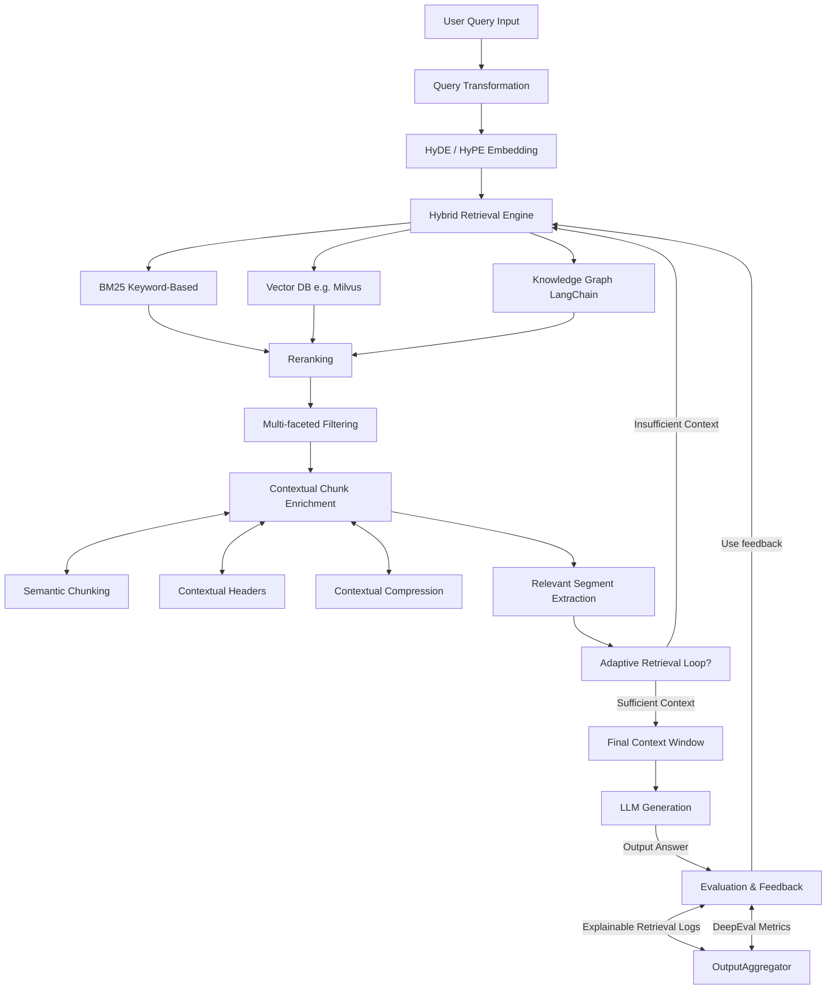

# Advanced RAG Pipeline 🚀

A production-ready Retrieval-Augmented Generation (RAG) system with advanced features including hybrid retrieval, adaptive feedback loops, comprehensive evaluation, and explainable AI logging.

## 🌟 Features

### Core RAG Capabilities
- **Hybrid Retrieval**: Combines BM25 lexical search, vector similarity, and knowledge graph traversal
- **Adaptive Retrieval**: Self-improving retrieval with feedback loops and quality assessment
- **Advanced Query Processing**: Intent detection, entity extraction, and query transformation
- **Intelligent Reranking**: Reciprocal Rank Fusion (RRF) and cross-encoder reranking
- **Context Enrichment**: Smart chunking, contextual headers, and compression

### Production Features
- **Comprehensive Evaluation**: DeepEval metrics with fallback heuristics
- **Explainable AI**: Detailed retrieval traces and transparent decision logging
- **Performance Monitoring**: Real-time metrics collection and pipeline health tracking
- **Structured Logging**: JSON-based logging with operation context
- **Error Handling**: Robust exception handling with detailed error reporting

### Supported Components
- **LLM Integration**: GROQ API support with async context management
- **Vector Databases**: Milvus integration for similarity search
- **Knowledge Graphs**: NetworkX-based graph traversal and reasoning
- **Embedding Models**: Sentence Transformers with batch processing
- **Evaluation Frameworks**: DeepEval integration for quality assessment

## 🏗️ Architecture



## 📦 Installation

### Prerequisites
- Python 3.8+
- GROQ API key (for LLM generation)
- Optional: Milvus (for vector search)
- Optional: spaCy English model

### Step 1: Clone the Repository
```bash
git clone <repository-url>
cd RAG_ATTEMPT
```

### Step 2: Create Virtual Environment
```bash
python -m venv venv
source venv/bin/activate  # On Windows: venv\Scripts\activate
```

### Step 3: Install Dependencies
```bash
pip install -r requirements.txt
```

### Step 4: Install Optional Dependencies
```bash
# For advanced NLP features
python -m spacy download en_core_web_sm

# For cross-encoder reranking
pip install sentence-transformers

# For DeepEval metrics
pip install deepeval
```

### Step 5: Set Environment Variables
```bash
# Required for LLM generation
export GROQ_API_KEY="your-groq-api-key-here"

# Optional: Configure Milvus (if using vector search)
export MILVUS_HOST="localhost"
export MILVUS_PORT="19530"
```

## 🚀 Quick Start

### Basic Usage
```python
import asyncio
from example_usage import demonstrate_basic_usage

# Run basic RAG demo
asyncio.run(demonstrate_basic_usage())
```

### Advanced Features Demo
```python
import asyncio
from example_usage import demonstrate_advanced_features

# Run advanced features demo
asyncio.run(demonstrate_advanced_features())
```

### Component Testing
```python
import asyncio
from example_usage import demonstrate_component_testing

# Test individual components
asyncio.run(demonstrate_component_testing())
```

### Custom Implementation
```python
import asyncio
from config.settings import RAGConfig, LLMConfig
from example_usage import RAGPipeline, create_sample_documents

async def custom_rag_example():
    # Configure the pipeline
    config = RAGConfig(
        llm=LLMConfig(
            provider="groq",
            model="deepseek-r1-distill-llama-70b",
            api_key="your-api-key-here",
            temperature=0.1
        )
    )
    
    # Create your documents
    documents = create_sample_documents()
    
    # Initialize pipeline
    pipeline = RAGPipeline(config, documents)
    
    # Query the pipeline
    response = await pipeline.query("What is machine learning?")
    
    print(f"Answer: {response.answer}")
    print(f"Sources: {len(response.sources)}")
    print(f"Confidence: {response.confidence}")

# Run custom example
asyncio.run(custom_rag_example())
```

## 📁 Project Structure

```
RAG_ATTEMPT/
├── 📁 core/                    # Core abstractions and utilities
│   ├── interfaces.py           # Base classes and data models
│   ├── exceptions.py           # Custom exception classes
│   ├── logger.py              # Structured logging setup
│   └── metrics.py             # Performance metrics collection
│
├── 📁 config/                  # Configuration management
│   └── settings.py            # RAG configuration classes
│
├── 📁 components/              # Core RAG components
│   ├── query_processor.py     # Query analysis and transformation
│   ├── embedding.py           # Embedding services and HyDE
│   ├── orchestrator.py        # Multi-retriever orchestration
│   ├── reranker.py           # Result reranking algorithms
│   ├── filter.py             # Advanced result filtering
│   ├── context_enricher.py   # Context preparation and enrichment
│   ├── llm_client.py         # LLM API integration
│   ├── adaptive_retrieval.py # Adaptive retrieval with feedback
│   │
│   └── 📁 retrievers/         # Retrieval implementations
│       ├── bm25_retriever.py  # BM25 lexical search
│       ├── vector_retrieval.py # Vector similarity search
│       └── kg_retriever.py    # Knowledge graph traversal
│
├── 📁 evaluation/              # Evaluation and monitoring
│   ├── deepeval_metrics.py   # DeepEval integration
│   └── explainable_logs.py   # Transparent decision logging
│
├── example_usage.py           # Comprehensive usage examples
├── requirements.txt           # Python dependencies
└── README.md                 # This file
```

## ⚙️ Configuration

The system uses dataclass-based configuration for easy customization:

```python
from config.settings import RAGConfig, LLMConfig, RetrievalConfig

config = RAGConfig(
    # LLM Configuration
    llm=LLMConfig(
        provider="groq",
        model="deepseek-r1-distill-llama-70b",
        api_key="your-api-key",
        temperature=0.1,
        max_tokens=2048
    ),
    
    # Retrieval Configuration
    retrieval=RetrievalConfig(
        top_k_bm25=20,        # BM25 results to retrieve
        top_k_vector=20,      # Vector search results
        top_k_kg=15,          # Knowledge graph results
        final_top_k=10,       # Final results after filtering
        rerank_threshold=0.5,  # Minimum relevance score
        min_chunk_size=100,   # Minimum chunk size
        max_chunk_size=1000   # Maximum chunk size
    ),
    
    # Pipeline Configuration
    max_context_length=16000,              # Max tokens for LLM context
    adaptive_retrieval_max_iterations=3,   # Max adaptive iterations
    enable_caching=True,                   # Enable result caching
    log_level="INFO"                       # Logging level
)
```

## 🔧 Components Deep Dive

### Query Processor
- **Intent Detection**: Classifies queries into categories (definition, how-to, comparison, etc.)
- **Entity Extraction**: Uses spaCy to identify named entities and noun phrases
- **Query Expansion**: Adds synonyms and related terms to improve retrieval
- **Normalization**: Standardizes contractions and formatting

### Hybrid Orchestrator
- **Parallel Retrieval**: Runs multiple retrievers simultaneously
- **Error Handling**: Graceful degradation when retrievers fail
- **Load Balancing**: Distributes queries across available retrievers
- **Performance Monitoring**: Tracks retrieval times and success rates

### Adaptive Retrieval Loop
- **Quality Assessment**: Evaluates context coverage, diversity, and answerability
- **Feedback Loops**: Adjusts queries based on retrieval quality
- **Iterative Improvement**: Refines search strategy across iterations
- **Smart Termination**: Stops when quality threshold is met or max iterations reached

### Advanced Filtering
- **Deduplication**: Removes similar or identical content
- **Quality Scoring**: Filters low-quality documents
- **Relevance Thresholding**: Applies minimum relevance scores
- **Diversity Enforcement**: Ensures variety in selected results

### Context Enricher
- **Semantic Chunking**: Preserves meaning when splitting long documents
- **Contextual Headers**: Adds metadata and retrieval information
- **Token Management**: Respects LLM context window limits
- **Compression**: Extracts key sentences when needed

## 📊 Evaluation and Monitoring

### Built-in Metrics
- **Retrieval Metrics**: Precision, recall, F1-score per retriever
- **Performance Metrics**: Response time, throughput, error rates
- **Quality Metrics**: Faithfulness, relevance, context utilization
- **Pipeline Health**: Overall system performance indicators

### DeepEval Integration
```python
from evaluation.deepeval_metrics import DeepEvalMetricsEvaluator

evaluator = DeepEvalMetricsEvaluator(llm_client)
results = await evaluator.evaluate_response(query_context, response, sources)

print(f"Faithfulness: {results.faithfulness_score}")
print(f"Relevancy: {results.relevancy_score}")
print(f"Context Quality: {results.context_relevancy_score}")
```

### Explainable Logging
```python
from evaluation.explainable_logs import ExplainableRetrievalLogger

logger = ExplainableRetrievalLogger()
trace_id = await logger.log_retrieval_trace(
    query_context, retrieval_results, filtered_results, 
    final_context, response
)

# Export detailed traces
logger.export_traces("retrieval_analysis.json")
```

## 🎯 Use Cases

### Enterprise Search
- **Document Retrieval**: Search across company knowledge base
- **Policy Questions**: Answer HR and compliance queries
- **Technical Support**: Provide contextual help documentation

### Research Assistant
- **Literature Review**: Find relevant academic papers
- **Fact Checking**: Verify claims against trusted sources
- **Synthesis**: Combine information from multiple sources

### Customer Support
- **FAQ Automation**: Answer common customer questions
- **Product Information**: Provide detailed product specifications
- **Troubleshooting**: Guide users through problem resolution

### Educational Tools
- **Study Assistant**: Help with homework and research
- **Concept Explanation**: Break down complex topics
- **Practice Questions**: Generate contextual practice problems

## 🔍 Advanced Usage

### Custom Retrievers
```python
from core.interfaces import BaseRetriever, RetrievalResult

class CustomRetriever(BaseRetriever):
    async def retrieve(self, query_context, top_k):
        # Your custom retrieval logic
        results = []
        # ... implementation
        return results

# Add to orchestrator
retrievers["custom"] = CustomRetriever()
orchestrator = HybridRetrievalOrchestrator(retrievers, config)
```

### Custom Evaluation Metrics
```python
from evaluation.deepeval_metrics import DeepEvalMetricsEvaluator

class CustomEvaluator(DeepEvalMetricsEvaluator):
    async def custom_metric(self, query, response, context):
        # Your custom evaluation logic
        score = calculate_custom_score(query, response, context)
        return score
```

### Integration with Vector Databases
```python
# Milvus setup (requires running Milvus instance)
from components.retrievers.vector_retrieval import MilvusVectorRetriever

config.vector_db = VectorDBConfig(
    host="localhost",
    port=19530,
    collection_name="documents",
    embedding_dim=384
)

vector_retriever = MilvusVectorRetriever(config.vector_db, embedding_service)
```

## 📈 Performance Optimization

### Caching Strategies
- **Query Caching**: Cache responses for identical queries
- **Embedding Caching**: Store computed embeddings
- **Result Caching**: Cache retrieval results

### Batch Processing
```python
# Batch embed multiple documents
embeddings = await embedding_service.embed_batch(document_texts)

# Batch retrieve for multiple queries
results = await orchestrator.batch_retrieve(query_contexts)
```

### Async Optimization
- All components are fully async
- Parallel retrieval across multiple sources
- Non-blocking LLM API calls
- Concurrent evaluation metrics

## 🛠️ Production Deployment

### Environment Setup
```bash
# Production environment variables
export GROQ_API_KEY="prod-api-key"
export LOG_LEVEL="WARNING"
export CACHE_TTL=3600
export MAX_CONTEXT_LENGTH=16000
export ENABLE_METRICS=true
```

### Docker Deployment
```dockerfile
FROM python:3.9-slim

WORKDIR /app
COPY requirements.txt .
RUN pip install -r requirements.txt

COPY . .
CMD ["python", "-m", "uvicorn", "api:app", "--host", "0.0.0.0", "--port", "8000"]
```

### Monitoring and Alerting
```python
# Set up monitoring
metrics_collector = MetricsCollector()

# Configure alerts for performance degradation
if avg_response_time > 5.0:
    send_alert("High response time detected")

if success_rate < 0.95:
    send_alert("Low success rate detected")
```

### Security Considerations
- **API Key Management**: Use environment variables or secret management
- **Input Validation**: Sanitize and validate all user inputs
- **Rate Limiting**: Implement request rate limiting
- **Access Control**: Add authentication and authorization
- **Data Privacy**: Handle sensitive information appropriately

## 🧪 Testing

### Unit Tests
```bash
# Run component tests
python -m pytest tests/test_components.py

# Run integration tests
python -m pytest tests/test_integration.py

# Run performance tests
python -m pytest tests/test_performance.py
```

### Manual Testing
```python
# Test individual components
asyncio.run(demonstrate_component_testing())

# Test full pipeline
asyncio.run(demonstrate_basic_usage())

# Test advanced features
asyncio.run(demonstrate_advanced_features())
```

## 🤝 Contributing

1. **Fork the Repository**: Create your own fork
2. **Create Feature Branch**: `git checkout -b feature/amazing-feature`
3. **Make Changes**: Implement your improvements
4. **Add Tests**: Ensure your changes are tested
5. **Update Documentation**: Keep docs up to date
6. **Submit Pull Request**: Create a PR with detailed description

### Development Setup
```bash
# Install development dependencies
pip install -r requirements-dev.txt

# Install pre-commit hooks
pre-commit install

# Run linting
black . && flake8 . && mypy .

# Run all tests
pytest --cov=. --cov-report=html
```

## 📋 Roadmap

### Upcoming Features
- [ ] **Multi-modal Support**: Image and document processing
- [ ] **Streaming Responses**: Real-time response generation
- [ ] **A/B Testing**: Compare different retrieval strategies
- [ ] **Auto-scaling**: Dynamic resource allocation
- [ ] **GraphRAG**: Enhanced knowledge graph integration
- [ ] **Fine-tuning**: Custom model training capabilities

### Planned Improvements
- [ ] **Performance**: Optimize retrieval speed and accuracy
- [ ] **Scalability**: Support for larger document collections
- [ ] **UI/UX**: Web interface for easier interaction
- [ ] **Analytics**: Advanced usage analytics and insights
- [ ] **Integration**: More LLM providers and vector databases

## ❓ FAQ

### General Questions

**Q: What makes this RAG system "advanced"?**
A: This system includes production-grade features like adaptive retrieval, comprehensive evaluation, explainable logging, hybrid search strategies, and robust error handling that go beyond basic RAG implementations.

**Q: Can I use this without a GROQ API key?**
A: The system will work for retrieval and evaluation components, but LLM generation requires a valid API key. You can test individual components without it.

**Q: How do I add my own documents?**
A: Replace the sample documents in `create_sample_documents()` with your own Document objects, or modify the pipeline initialization to load from your data source.

### Technical Questions

**Q: Why use hybrid retrieval instead of just vector search?**
A: Hybrid retrieval combines the strengths of different approaches: BM25 excels at exact keyword matching, vector search handles semantic similarity, and knowledge graphs provide structured reasoning.

**Q: How does adaptive retrieval work?**
A: The system evaluates retrieval quality using multiple metrics (coverage, diversity, answerability) and iteratively refines the query if quality is below threshold, up to a maximum number of iterations.

**Q: Can I customize the evaluation metrics?**
A: Yes, you can extend the `DeepEvalMetricsEvaluator` class or create custom evaluation functions. The system supports both automated metrics and custom heuristics.

### Deployment Questions

**Q: Is this ready for production?**
A: The codebase includes production-grade features, but you'll need to add proper authentication, monitoring, scaling, and infrastructure management for a full production deployment.

**Q: How do I scale this for large document collections?**
A: For large-scale deployment, set up a proper vector database (Milvus), implement document chunking strategies, use caching, and consider distributing retrievers across multiple instances.

**Q: What about data privacy and security?**
A: The system processes data locally except for LLM API calls. Implement proper input sanitization, use secure API key management, and ensure compliance with your privacy requirements.

## 📞 Support

### Getting Help
- **Documentation**: Check this README and inline code comments
- **Issues**: Create GitHub issues for bugs or feature requests
- **Discussions**: Use GitHub Discussions for questions and ideas
- **Examples**: See `example_usage.py` for comprehensive usage patterns

### Common Issues

**Import Errors**: Ensure all dependencies are installed and virtual environment is activated
**API Errors**: Verify GROQ API key is set and valid
**Model Download**: Some components require downloading models (spaCy, sentence-transformers)
**Memory Issues**: Adjust batch sizes and context lengths for your hardware

## 📄 License

This project is licensed under the MIT License - see the [LICENSE](LICENSE) file for details.

## 🙏 Acknowledgments

- **Sentence Transformers**: For embedding models and similarity computation
- **GROQ**: For fast LLM inference API
- **Milvus**: For scalable vector similarity search
- **DeepEval**: For comprehensive RAG evaluation metrics
- **NetworkX**: For knowledge graph operations
- **spaCy**: For natural language processing
- **Structlog**: For structured logging capabilities

---

## 🚀 Ready to Build Amazing RAG Applications?

Start with the basic demo and explore the advanced features. This system provides a solid foundation for building production-ready RAG applications with transparency, reliability, and performance.

```bash
# Get started now!
python example_usage.py
```

**Happy RAG Building! 🎯**
