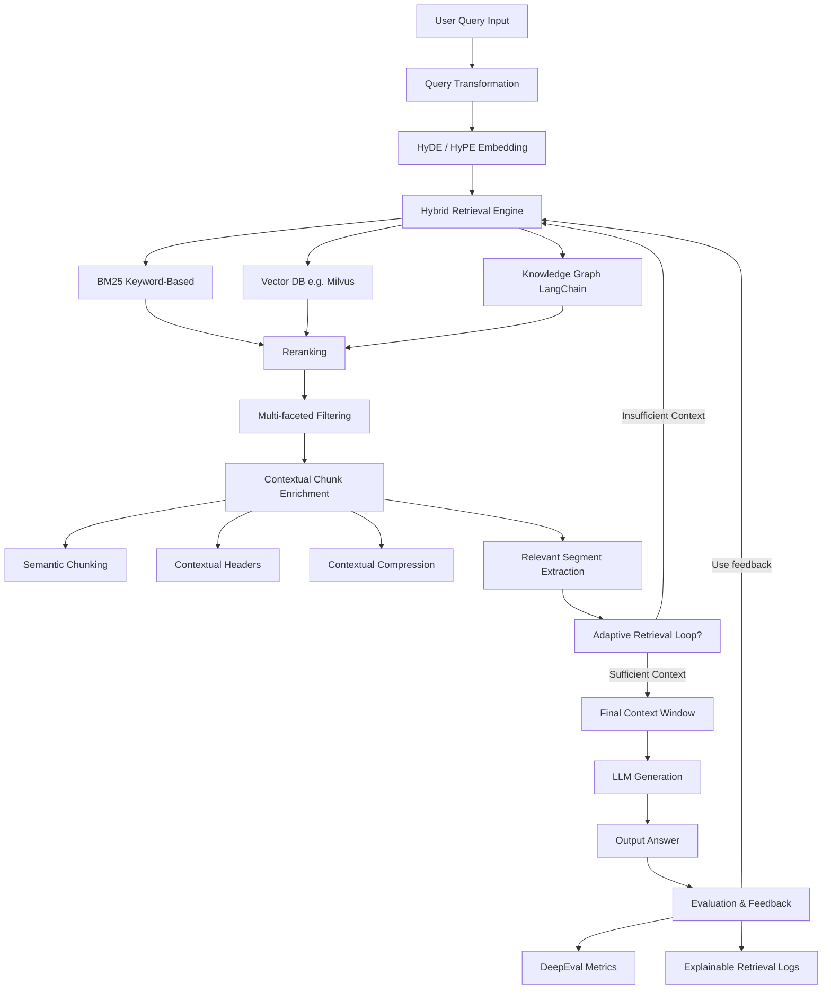

# FusionRAG: Hybrid Retrieval-Augmented Generation System

[](https://www.python.org/downloads/)
[](LICENSE)
[]()

A sophisticated Retrieval-Augmented Generation (RAG) system that combines multiple retrieval strategies with adaptive query enrichment and contextual optimization for reliable knowledge grounding.

## 🚀 Features

### 🔄 **Hybrid Retrieval Engine**
- **BM25 Keyword-Based Retrieval**: Traditional TF-IDF based search
- **Vector Database Retrieval**: Semantic similarity search using FAISS
- **Knowledge Graph Retrieval**: Structured information retrieval via LangChain
- **Reciprocal Rank Fusion (RRF)**: Intelligent combination of multiple retrieval methods

### 🧠 **Adaptive Query Enrichment**
- **HyDE (Hypothetical Document Embedding)**: Generates hypothetical documents to improve retrieval
- **Query Transformation**: Intelligent query preprocessing and enhancement
- **Multi-faceted Filtering**: Advanced filtering mechanisms for context refinement

### 🔄 **Adaptive Retrieval Loop**
- **Context Sufficiency Evaluation**: Automatic assessment of retrieved context quality
- **Iterative Retrieval**: Multi-pass retrieval with parameter adjustment
- **Feedback Integration**: Uses retrieval feedback to refine subsequent queries

### 📊 **Contextual Optimization**
- **Semantic Chunking**: Intelligent document segmentation
- **Contextual Headers**: Enhanced chunk metadata
- **Contextual Compression**: Redundancy reduction and relevance optimization
- **Dynamic Context Window**: Adaptive context length management

### 📈 **Comprehensive Evaluation**
- **DeepEval Metrics**: Quantitative evaluation framework
- **Explainable Retrieval Logs**: Transparent retrieval process tracking
- **Retrieval Quality Assessment**: Precision, Recall, F1-score metrics

## 🏗️ Architecture

The FusionRAG system implements a sophisticated multi-stage pipeline:


```mermaid
flowchart TD
    %% Input and Query Transformation
    A[User Query Input] --> B[Query Transformation]
    B --> B1[HyDE / HyPE Embedding]
    B1 --> C[Hybrid Retrieval Engine]

    %% Retrieval Nodes
    C --> C1[BM25 Keyword-Based]
    C --> C2[Vector DB e.g. Milvus]
    C --> C3[Knowledge Graph LangChain]

    %% Reranking and Filtering
    C1 --> D[Reranking]
    C2 --> D
    C3 --> D
    D --> E[Multi-faceted Filtering]

    %% Context Enrichment
    E --> F[Contextual Chunk Enrichment]
    F --> F1[Semantic Chunking]
    F --> F2[Contextual Headers]
    F --> F3[Contextual Compression]
    F --> F4[Relevant Segment Extraction]

    %% Iterative Retrieval Logic
    F4 --> G[Adaptive Retrieval Loop?]
    G -->|Insufficient Context| C
    G -->|Sufficient Context| H[Final Context Window]

    %% LLM and Output
    H --> I[LLM Generation]
    I --> J[Output Answer]

    %% Evaluation Layer
    J --> K[Evaluation & Feedback]
    K --> K1[DeepEval Metrics]
    K --> K2[Explainable Retrieval Logs]
    K -->|Use feedback| C
```

### Core Components

1. **Query Processing Layer**
   - Query transformation and enrichment
   - HyDE embedding generation
   - Multi-modal query understanding

2. **Hybrid Retrieval Layer**
   - Multiple retrieval engines (BM25, Vector DB, Knowledge Graph)
   - Reciprocal Rank Fusion for result combination
   - Weighted ensemble methods

3. **Context Management Layer**
   - Adaptive retrieval loops
   - Context sufficiency evaluation
   - Dynamic context window optimization

4. **Generation & Evaluation Layer**
   - LLM integration and response generation
   - Comprehensive evaluation metrics
   - Explainable AI logging

## 📦 Installation

### Prerequisites
- Python 3.8 or higher
- pip package manager

### Quick Start

```bash
# Clone the repository
git clone https://github.com/THAMIZH-ARASU/FusionRAG.git
cd FusionRAG

# Create virtual environment
python -m venv venv
source venv/bin/activate  # On Windows: venv\Scripts\activate

# Install dependencies
pip install -r requirements.txt
```

### Dependencies

The system requires the following key dependencies:

```txt
langchain              # Knowledge graph and chain management
sentence-transformers  # Hugging Face sentence embeddings
faiss-cpu             # Vector similarity search
PyPDF2                # PDF document processing
python-docx           # Word document processing
openai                # OpenAI API integration
numpy                 # Numerical computations
pandas                # Data manipulation
tiktoken              # Token counting
rich                  # Rich console output
pydantic              # Data validation
```

## 🚀 Quick Start

### Basic Usage

```python
from pipelines.rag_factory import RAGPipelineFactory
from core_utils.llm_integration import LLMIntegration

# Create a basic pipeline
pipeline = RAGPipelineFactory.create_basic_pipeline()

# Load documents
file_paths = [
    'documents/doc1.pdf',
    'documents/doc2.docx',
    'documents/doc3.txt'
]
pipeline.load_documents(file_paths)

# Index documents
pipeline.index_documents()

# Query the pipeline
query = "What is artificial intelligence?"
result = pipeline.query(query, use_adaptive_retrieval=True)

# Get context and generate response
context = result['context']
llm = LLMIntegration('openai', api_key='your-api-key')
final_answer = llm.generate_response(query, context)

print(f"Query: {query}")
print(f"Answer: {final_answer}")
print(f"Retrieval Logs: {pipeline.get_explainable_logs(result)}")
```

### Advanced Configuration

```python
# Create an advanced pipeline with all features
advanced_pipeline = RAGPipelineFactory.create_advanced_pipeline(
    embedding_model='all-MiniLM-L6-v2',
    retrieval_engines=['bm25', 'vector_db', 'knowledge_graph'],
    use_hyde=True,
    max_adaptive_iterations=5
)

# Create a lightweight pipeline for resource-constrained environments
lightweight_pipeline = RAGPipelineFactory.create_lightweight_pipeline(
    chunk_size=500,
    max_context_length=2000
)
```

## 🔧 Configuration Options

### Pipeline Configurations

| Configuration | Basic | Advanced | Lightweight |
|---------------|-------|----------|-------------|
| Embedding Model | all-MiniLM-L6-v2 | all-MiniLM-L6-v2 | all-MiniLM-L6-v2 |
| Retrieval Engines | BM25, Vector DB | BM25, Vector DB, Knowledge Graph | BM25 only |
| Chunk Size | 1000 | 800 | 500 |
| Max Context Length | 4000 | 6000 | 2000 |
| HyDE | Disabled | Enabled | Disabled |
| Adaptive Iterations | 3 | 5 | 1 |

### Custom Configuration

```python
custom_config = {
    'embedding_engine': 'huggingface',
    'embedding_model': 'all-MiniLM-L6-v2',
    'retrieval_engines': ['bm25', 'vector_db'],
    'retrieval_weights': {'bm25': 0.3, 'vector_db': 0.7},
    'chunk_size': 1000,
    'chunk_overlap': 200,
    'chunking_strategy': 'recursive',
    'max_context_length': 4000,
    'max_adaptive_iterations': 3,
    'use_hyde': False
}

pipeline = RAGPipeline(custom_config)
```

## 📚 Supported Document Types

The system supports multiple document formats:

- **PDF Documents** (.pdf)
- **Word Documents** (.docx)
- **Text Files** (.txt)
- **Extensible**: Easy to add new document types

## 🔍 Retrieval Engines

### BM25 Engine
Traditional keyword-based retrieval using TF-IDF scoring.

```python
from retrieval_engines.bm25_engine import BM25Engine

bm25_engine = BM25Engine()
results = bm25_engine.retrieve(query, k=10)
```

### Vector Database Engine
Semantic similarity search using FAISS and sentence embeddings.

```python
from retrieval_engines.vectordb_engine import VectorDBEngine
from embedding_engines.huggingface_embedding import HuggingFaceEmbedding

embedding_engine = HuggingFaceEmbedding('all-MiniLM-L6-v2')
vector_engine = VectorDBEngine(embedding_engine)
results = vector_engine.retrieve(query, k=10)
```

### Knowledge Graph Engine
Structured information retrieval using LangChain.

```python
from retrieval_engines.knowledge_graph_engine import KnowledgeGraphEngine

kg_engine = KnowledgeGraphEngine()
results = kg_engine.retrieve(query, k=10)
```

### Hybrid Engine
Combines multiple retrieval engines using Reciprocal Rank Fusion.

```python
from retrieval_engines.hybrid_engine import HybridRetrievalEngine

hybrid_engine = HybridRetrievalEngine(
    engines={'bm25': bm25_engine, 'vector_db': vector_engine},
    weights={'bm25': 0.3, 'vector_db': 0.7}
)
```

## 🧠 Embedding Engines

### HuggingFace Embeddings
Standard sentence transformers for semantic embeddings.

```python
from embedding_engines.huggingface_embedding import HuggingFaceEmbedding

embedding_engine = HuggingFaceEmbedding('all-MiniLM-L6-v2')
embeddings = embedding_engine.embed_query("Your query here")
```

### HyDE Embeddings
Hypothetical Document Embedding for improved retrieval.

```python
from embedding_engines.hyde_embedding import HyDEEmbedding

hyde_engine = HyDEEmbedding(base_embedding_engine, llm_client)
embeddings = hyde_engine.embed_query("Your query here")
```

## 🔄 Adaptive Retrieval Loop

The system implements intelligent adaptive retrieval:

```python
from core_utils.adaptive_retrieval_loop import AdaptiveRetrievalLoop

adaptive_loop = AdaptiveRetrievalLoop(
    retrieval_engine=hybrid_engine,
    context_manager=context_manager,
    max_iterations=3
)

context, metadata = adaptive_loop.retrieve_with_feedback(query)
```

### Context Sufficiency Evaluation
- Automatic assessment of retrieved context quality
- Query term coverage analysis
- Minimum context length validation
- Iterative retrieval with parameter adjustment

## 📊 Evaluation and Metrics

### Retrieval Evaluation

```python
from core_utils.rag_evaluator import RAGEvaluator

evaluator = RAGEvaluator()
metrics = evaluator.evaluate_retrieval(
    retrieved_docs=retrieved_documents,
    relevant_docs=ground_truth_documents
)

print(f"Precision: {metrics['precision']:.3f}")
print(f"Recall: {metrics['recall']:.3f}")
print(f"F1-Score: {metrics['f1']:.3f}")
```

### Context Relevance Evaluation

```python
relevance_score = evaluator.evaluate_context_relevance(context, query)
print(f"Context Relevance: {relevance_score:.3f}")
```

## 🔧 Advanced Features

### Context Management

```python
from core_utils.context_manager import ContextManager

context_manager = ContextManager(max_context_length=4000)
enriched_context = context_manager.enrich_context(documents, query)
```

### Text Chunking

```python
from core_utils.text_chunker import TextChunker

chunker = TextChunker(
    chunk_size=1000,
    overlap=200,
    strategy='recursive'  # Options: 'simple', 'recursive', 'semantic'
)
chunks = chunker.chunk_documents(documents)
```

### Query Transformation

```python
from core_utils.query_transformer import QueryTransformer

transformer = QueryTransformer()
transformed_query = transformer.transform_query(original_query)
```

## 🚀 Performance Optimization

### For Small Context LLMs

```python
def optimize_for_small_context_llm(pipeline, max_context_tokens=1000):
    """Optimize pipeline for LLMs with small context windows"""
    
    # Adjust context manager
    pipeline.context_manager.max_context_length = max_context_tokens
    
    # Use more aggressive chunking
    pipeline.text_chunker.chunk_size = min(pipeline.text_chunker.chunk_size, 300)
    pipeline.text_chunker.overlap = min(pipeline.text_chunker.overlap, 50)
    
    # Reduce retrieval count
    pipeline.config['max_adaptive_iterations'] = 1
    
    return pipeline
```

### Index Persistence

```python
# Save index for later use
pipeline.save_index('saved_index.pkl')

# Load existing index
pipeline.load_index('saved_index.pkl')
```

## 📝 Example Use Cases

### 1. Document Q&A System

```python
# Load technical documentation
pipeline.load_documents(['docs/api_reference.pdf', 'docs/user_guide.docx'])
pipeline.index_documents()

# Answer questions about the documentation
query = "How do I authenticate API requests?"
result = pipeline.query(query)
```

### 2. Research Assistant

```python
# Load research papers
pipeline.load_documents(['papers/paper1.pdf', 'papers/paper2.pdf'])
pipeline.index_documents()

# Get insights from research
query = "What are the latest developments in transformer architecture?"
result = pipeline.query(query, use_adaptive_retrieval=True)
```

### 3. Knowledge Base Search

```python
# Load knowledge base articles
pipeline.load_documents(['kb/article1.txt', 'kb/article2.txt'])
pipeline.index_documents()

# Search knowledge base
query = "How to troubleshoot network connectivity issues?"
result = pipeline.query(query)
```

## 🤝 Contributing

We welcome contributions! Please see our [Contributing Guidelines](CONTRIBUTING.md) for details.

### Development Setup

```bash
# Clone the repository
git clone https://github.com/your-username/FusionRAG.git
cd FusionRAG

# Create virtual environment
python -m venv venv
source venv/bin/activate

# Install development dependencies
pip install -r requirements.txt
pip install -r requirements-dev.txt

# Run tests
python -m pytest tests/
```

## 📄 License

This project is licensed under the MIT License - see the [LICENSE](LICENSE) file for details.

## 🙏 Acknowledgments

- **LangChain**: For knowledge graph integration
- **Hugging Face**: For sentence transformers and embeddings
- **FAISS**: For efficient vector similarity search
- **OpenAI**: For LLM integration capabilities

## 📞 Support

- **Issues**: [GitHub Issues](https://github.com/THAMIZH-ARASU/FusionRAG/issues)
- **Pull Requests**: [Github Pull Requests](https://github.com/THAMIZH-ARASU/FusionRAG/pulls)
- **Documentation**: [Github Wiki](https://github.com/THAMIZH-ARASU/FusionRAG/wiki)

---

**FusionRAG**: Empowering reliable knowledge grounding through hybrid retrieval and adaptive optimization. 🚀 