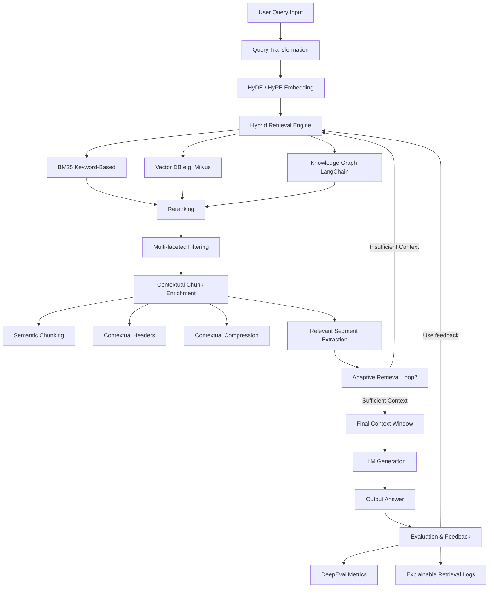

# FusionRAG: Hybrid Retrieval-Augmented Generation System

[](https://www.python.org/downloads/)
[](LICENSE)
[]()

A sophisticated Retrieval-Augmented Generation (RAG) system that combines multiple retrieval strategies with adaptive query enrichment and contextual optimization for reliable knowledge grounding.

## 🚀 Features

### 🔄 **Hybrid Retrieval Engine**
- **BM25 Keyword-Based Retrieval**: Traditional TF-IDF based search
- **Vector Database Retrieval**: Semantic similarity search using FAISS
- **Knowledge Graph Retrieval**: Structured information retrieval via LangChain
- **Reciprocal Rank Fusion (RRF)**: Intelligent combination of multiple retrieval methods

### 🧠 **Adaptive Query Enrichment**
- **HyDE (Hypothetical Document Embedding)**: Generates hypothetical documents to improve retrieval
- **Query Transformation**: Intelligent query preprocessing and enhancement
- **Multi-faceted Filtering**: Advanced filtering mechanisms for context refinement

### 🔄 **Adaptive Retrieval Loop**
- **Context Sufficiency Evaluation**: Automatic assessment of retrieved context quality
- **Iterative Retrieval**: Multi-pass retrieval with parameter adjustment
- **Feedback Integration**: Uses retrieval feedback to refine subsequent queries

### 📊 **Contextual Optimization**
- **Semantic Chunking**: Intelligent document segmentation
- **Contextual Headers**: Enhanced chunk metadata
- **Contextual Compression**: Redundancy reduction and relevance optimization
- **Dynamic Context Window**: Adaptive context length management

### 📈 **Comprehensive Evaluation**
- **DeepEval Metrics**: Quantitative evaluation framework
- **Explainable Retrieval Logs**: Transparent retrieval process tracking
- **Retrieval Quality Assessment**: Precision, Recall, F1-score metrics

### 🌐 **Web Interface**
- **Modern Flask UI**: Beautiful, responsive web interface
- **FastAPI Backend**: High-performance REST API
- **Document Upload**: Support for PDF, DOCX, TXT, MD files
- **Real-time Comparison**: Compare different RAG methods side-by-side
- **Metrics Visualization**: View processing times, context lengths, and other metrics

## 🏗️ Architecture

The FusionRAG system implements a sophisticated multi-stage pipeline:


```mermaid
flowchart TD
    %% Input and Query Transformation
    A[User Query Input] --> B[Query Transformation]
    B --> B1[HyDE / HyPE Embedding]
    B1 --> C[Hybrid Retrieval Engine]

    %% Retrieval Nodes
    C --> C1[BM25 Keyword-Based]
    C --> C2[Vector DB e.g. Milvus]
    C --> C3[Knowledge Graph LangChain]

    %% Reranking and Filtering
    C1 --> D[Reranking]
    C2 --> D
    C3 --> D
    D --> E[Multi-faceted Filtering]

    %% Context Enrichment
    E --> F[Contextual Chunk Enrichment]
    F --> F1[Semantic Chunking]
    F --> F2[Contextual Headers]
    F --> F3[Contextual Compression]
    F --> F4[Relevant Segment Extraction]

    %% Iterative Retrieval Logic
    F4 --> G[Adaptive Retrieval Loop?]
    G -->|Insufficient Context| C
    G -->|Sufficient Context| H[Final Context Window]

    %% LLM and Output
    H --> I[LLM Generation]
    I --> J[Output Answer]

    %% Evaluation Layer
    J --> K[Evaluation & Feedback]
    K --> K1[DeepEval Metrics]
    K --> K2[Explainable Retrieval Logs]
    K -->|Use feedback| C
```

### Core Components

1. **Query Processing Layer**
   - Query transformation and enrichment
   - HyDE embedding generation
   - Multi-modal query understanding

2. **Hybrid Retrieval Layer**
   - Multiple retrieval engines (BM25, Vector DB, Knowledge Graph)
   - Reciprocal Rank Fusion for result combination
   - Weighted ensemble methods

3. **Context Management Layer**
   - Adaptive retrieval loops
   - Context sufficiency evaluation
   - Dynamic context window optimization

4. **Generation & Evaluation Layer**
   - LLM integration and response generation
   - Comprehensive evaluation metrics
   - Explainable AI logging

## 📦 Installation

### Prerequisites
- Python 3.8 or higher
- pip package manager

### Quick Start

```bash
# Clone the repository
git clone https://github.com/THAMIZH-ARASU/FusionRAG.git
cd FusionRAG

# Create virtual environment
python -m venv venv
source venv/bin/activate  # On Windows: venv\Scripts\activate

# Install dependencies
pip install -r requirements.txt
pip install -r fast_api_backend/requirements.txt
pip install -r flask_ui/requirements.txt
```

### Environment Configuration

1. **Create Environment File**
   ```bash
   # The startup script will create this automatically, or you can create it manually
   cp fast_api_backend/.env.example fast_api_backend/.env
   ```

2. **Configure API Keys**
   Edit `fast_api_backend/.env` and add your API keys:
   ```env
   GROQ_API_KEY=your_GROQ_API_KEY_here
   GOOGLE_API_KEY=your_google_api_key_here
   OPENAI_API_KEY=your_openai_api_key_here
   ```

## 🚀 Running the Application

### Option 1: Using the Startup Script (Recommended)

```bash
# Start both FastAPI backend and Flask UI
python start_app.py
```

This will:
- Check dependencies
- Create .env file if needed
- Start FastAPI backend on http://localhost:8000
- Start Flask UI on http://localhost:5000

### Option 2: Manual Startup

#### Start FastAPI Backend
```bash
cd fast_api_backend
python -m uvicorn main:app --host 0.0.0.0 --port 8000 --reload
```

#### Start Flask UI
```bash
cd flask_ui
python app.py
```

## 🌐 Web Interface

Once the application is running, you can access:

- **Flask UI**: http://localhost:5000
- **FastAPI Docs**: http://localhost:8000/docs
- **FastAPI ReDoc**: http://localhost:8000/redoc

### Features Available in the Web Interface

1. **Document Upload**
   - Drag and drop or click to upload documents
   - Supports PDF, DOCX, TXT, MD formats
   - Automatic document indexing

2. **Query Interface**
   - Natural language querying
   - Multiple retrieval method selection
   - LLM provider selection (OpenAI, Groq, Google)
   - Adjustable parameters (max tokens, temperature)

3. **Method Comparison**
   - Side-by-side comparison of different RAG methods
   - Performance metrics visualization
   - Processing time analysis

4. **System Status**
   - Real-time system health monitoring
   - Document count and indexing status
   - Available retrieval methods

## 🔧 API Endpoints

### FastAPI Backend Endpoints

- `GET /` - Root endpoint
- `GET /health` - System health check
- `POST /upload` - Upload documents
- `POST /index` - Index uploaded documents
- `POST /query` - Query documents using RAG
- `POST /compare` - Compare different RAG methods
- `GET /documents` - List uploaded documents
- `DELETE /documents/{id}` - Delete a document

### Example API Usage

```python
import requests

# Upload a document
with open('document.pdf', 'rb') as f:
    files = {'file': f}
    response = requests.post('http://localhost:8000/upload', files=files)

# Query documents
payload = {
    'query': 'What is artificial intelligence?',
    'retrieval_methods': ['hybrid'],
    'llm_provider': 'openai',
    'max_tokens': 1000,
    'temperature': 0.7
}
response = requests.post('http://localhost:8000/query', json=payload)
result = response.json()
```

## 📚 Supported Document Types

The system supports multiple document formats:

- **PDF Documents** (.pdf)
- **Word Documents** (.docx)
- **Text Files** (.txt)
- **Markdown Files** (.md)
- **Extensible**: Easy to add new document types

## 🔍 Retrieval Engines

### BM25 Engine
Traditional keyword-based retrieval using TF-IDF scoring.

```python
from retrieval_engines.bm25_engine import BM25Engine

bm25_engine = BM25Engine()
results = bm25_engine.retrieve(query, k=10)
```

### Vector Database Engine
Semantic similarity search using FAISS and sentence embeddings.

```python
from retrieval_engines.vectordb_engine import VectorDBEngine

vector_engine = VectorDBEngine(embedding_engine)
results = vector_engine.retrieve(query, k=10)
```

### Knowledge Graph Engine
Structured information retrieval using LangChain.

```python
from retrieval_engines.knowledge_graph_engine import KnowledgeGraphEngine

kg_engine = KnowledgeGraphEngine()
results = kg_engine.retrieve(query, k=10)
```

### Hybrid Engine
Combines multiple retrieval methods using Reciprocal Rank Fusion.

```python
from retrieval_engines.hybrid_engine import HybridRetrievalEngine

hybrid_engine = HybridRetrievalEngine([bm25_engine, vector_engine, kg_engine])
results = hybrid_engine.retrieve(query, k=10)
```

## 🎯 Usage Examples

### Basic Usage

```python
from pipelines.rag_factory import RAGPipelineFactory
from core_utils.llm_integration import LLMIntegration

# Create a basic pipeline
pipeline = RAGPipelineFactory.create_basic_pipeline()

# Load documents
file_paths = [
    'documents/doc1.pdf',
    'documents/doc2.docx',
    'documents/doc3.txt'
]
pipeline.load_documents(file_paths)

# Index documents
pipeline.index_documents()

# Query the pipeline
query = "What is artificial intelligence?"
result = pipeline.query(query, use_adaptive_retrieval=True)

# Get context and generate response
context = result['context']
llm = LLMIntegration('openai', api_key='your-api-key')
final_answer = llm.generate_response(query, context)

print(f"Query: {query}")
print(f"Answer: {final_answer}")
print(f"Retrieval Logs: {pipeline.get_explainable_logs(result)}")
```

### Advanced Configuration

```python
# Create an advanced pipeline with all features
advanced_pipeline = RAGPipelineFactory.create_advanced_pipeline(
    embedding_model='all-MiniLM-L6-v2',
    retrieval_engines=['bm25', 'vector_db', 'knowledge_graph'],
    use_hyde=True,
    max_adaptive_iterations=5
)

# Create a lightweight pipeline for resource-constrained environments
lightweight_pipeline = RAGPipelineFactory.create_lightweight_pipeline(
    chunk_size=500,
    max_context_length=2000
)
```

## 🔧 Configuration Options

### Pipeline Configurations

| Configuration | Basic | Advanced | Lightweight |
|---------------|-------|----------|-------------|
| Embedding Model | all-MiniLM-L6-v2 | all-MiniLM-L6-v2 | all-MiniLM-L6-v2 |
| Retrieval Engines | BM25, Vector DB | BM25, Vector DB, Knowledge Graph | BM25 only |
| Chunk Size | 1000 | 800 | 500 |
| Max Context Length | 4000 | 6000 | 2000 |
| HyDE | Disabled | Enabled | Disabled |
| Adaptive Iterations | 3 | 5 | 1 |

### Custom Configuration

```python
custom_config = {
    'embedding_engine': 'huggingface',
    'embedding_model': 'all-MiniLM-L6-v2',
    'retrieval_engines': ['bm25', 'vector_db'],
    'retrieval_weights': {'bm25': 0.3, 'vector_db': 0.7},
    'chunk_size': 1000,
    'chunk_overlap': 200,
    'chunking_strategy': 'recursive',
    'max_context_length': 4000,
    'max_adaptive_iterations': 3,
    'use_hyde': False
}

pipeline = RAGPipeline(custom_config)
```

## 🧪 Testing

```bash
# Run tests
python -m pytest tests/

# Run with coverage
python -m pytest tests/ --cov=fusion_rag --cov-report=html
```

## 📊 Performance Metrics

The system provides comprehensive performance metrics:

- **Retrieval Quality**: Precision, Recall, F1-score
- **Processing Time**: Query processing and response generation time
- **Context Quality**: Context length and relevance scores
- **System Performance**: Memory usage, CPU utilization

## 🤝 Contributing

1. Fork the repository
2. Create a feature branch (`git checkout -b feature/amazing-feature`)
3. Commit your changes (`git commit -m 'Add some amazing feature'`)
4. Push to the branch (`git push origin feature/amazing-feature`)
5. Open a Pull Request

## 📄 License

This project is licensed under the MIT License - see the [LICENSE](LICENSE) file for details.

## 🙏 Acknowledgments

- **LangChain**: For knowledge graph integration
- **Hugging Face**: For sentence transformers and embeddings
- **FAISS**: For efficient vector similarity search
- **OpenAI**: For LLM integration capabilities
- **FastAPI**: For high-performance API framework
- **Flask**: For web framework
- **Bootstrap**: For UI components

## 📞 Support

- **Issues**: [GitHub Issues](https://github.com/THAMIZH-ARASU/FusionRAG/issues)
- **Pull Requests**: [Github Pull Requests](https://github.com/THAMIZH-ARASU/FusionRAG/pulls)
- **Documentation**: [Github Wiki](https://github.com/THAMIZH-ARASU/FusionRAG/wiki)

---

**FusionRAG**: Empowering reliable knowledge grounding through hybrid retrieval and adaptive optimization. 🚀 